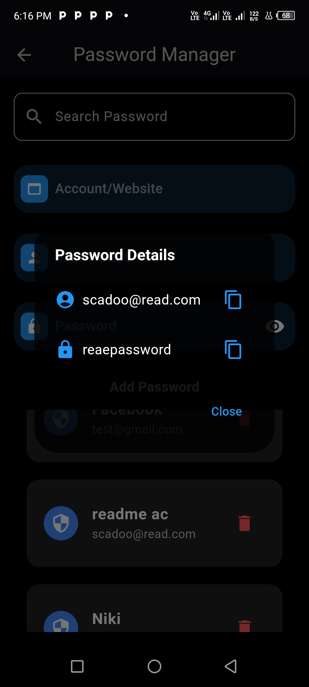

# SecureWave App

## Description
SecureWave is a comprehensive application designed to provide URL scanning, SMS filtering, and password management. It ensures your online safety by detecting phishing attempts and managing your passwords securely.

## Features
- **URL Scanning:** Scan URLs for potential security threats.
- **SMS Filtering:** Detect and filter phishing SMS messages.
- **Password Manager:** Securely manage and store your passwords.

## Screenshots
Below are some screenshots of the SecureWave app in action:

1. 
2. 
3. 
4. 
5. 
6. 
7. 
8. 

## Installation

### Prerequisites
- [Flutter](https://flutter.dev/docs/get-started/install)
- [Firebase](https://firebase.google.com/docs)

### Steps
1. Clone the repository:
   ```sh
   git clone https://github.com/AhmedAbdelrahime/securewave.git
